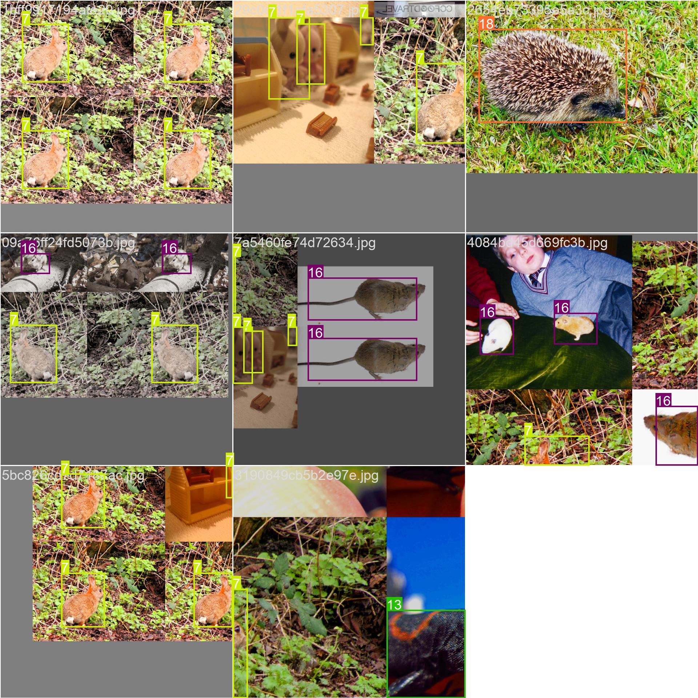
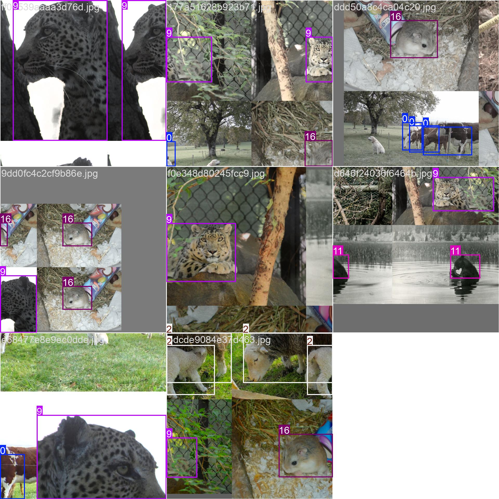
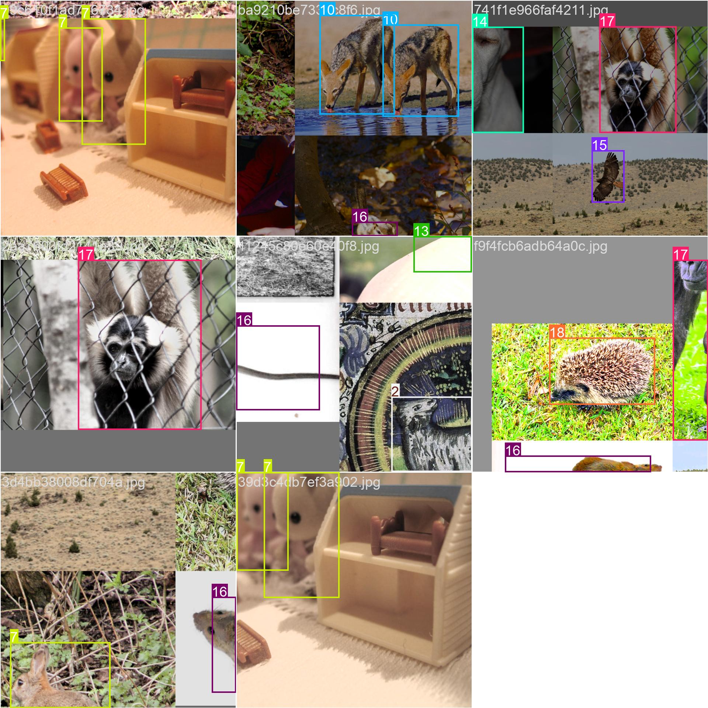
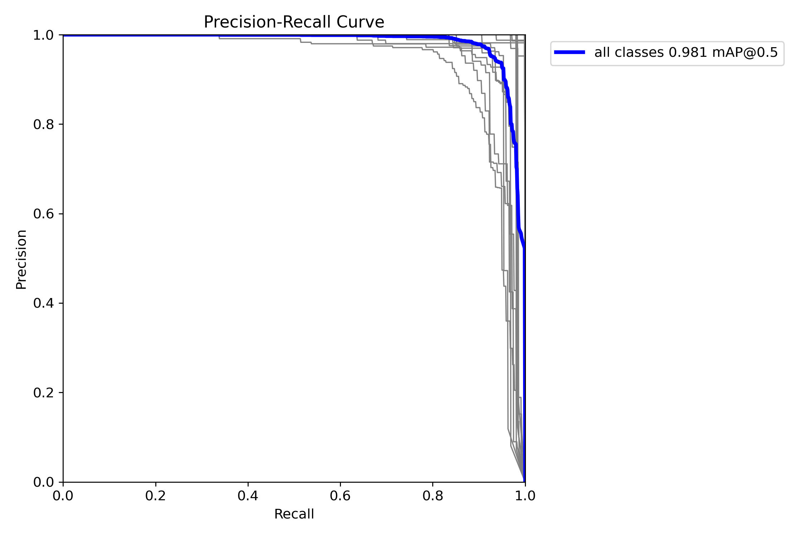
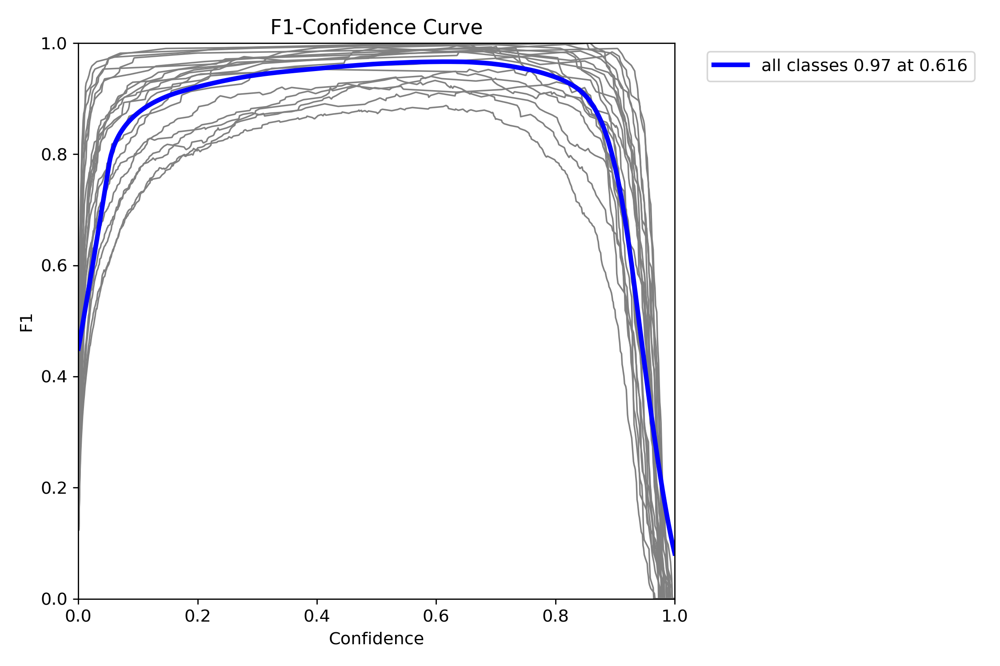

# 🦁 YOLOv8s Animal Detection on 21-Class Custom Dataset

This repository presents the training and evaluation of a **YOLOv8s** object detection model on a **custom 21-class animal dataset**, including species like **Cattle, Goat, Sheep, Chicken, Duck**, and more. The goal is accurate localization and classification of diverse animals in natural environments.

>  "Cattle", "Goat", "Sheep", "Chicken", "Duck", "Pig", "Horse", "Rabbit", "Tiger", "Leopard", "Fox", "Bear", "Snake", "Lizard", "Dog", "Eagle", "Mouse", "Monkey", "Porcupine", "Elephant", "Reptile"

---

## 📁 Dataset Overview

- **Number of Classes**: 24 animal species
- **Label Format**: YOLO (normalized `[x_center, y_center, width, height]`)
- **Annotation Distribution**:

- **Pairwise Feature Distribution (Correlogram)**:

---

## 🚀 Model: YOLOv8s

- **Framework**: Ultralytics YOLOv8
- **Model**: YOLOv8s (Small variant)
- **Training Duration**: 50 epochs
- **Losses Monitored**: Bounding box loss, classification loss, distribution focal loss (DFL)

### 🧪 Sample Training Batches

  
  
  

---

## 📈 Training Performance

- Significant improvement in:
  - **Precision**
  - **Recall**
  - **mAP@0.5** and **mAP@0.5:0.95**
- Loss curves (box, cls, dfl) show consistent decrease, indicating healthy convergence.

---

## 📊 Metric Curves

  
  

---

## 🔍 Confusion Matrix

| Raw Confusion Matrix | Normalized Confusion Matrix |
|----------------------|-----------------------------|
|  |  |

- Good separation among most classes.
- Minor confusion among similar species (e.g., Goat vs. Sheep).

---

## 🖼️ Validation Results

Visual comparisons of ground truth and predictions:

| Ground Truth | Prediction |
|--------------|------------|
|  |  |
|  |  |
|  |  |

---

## ✅ Highlights

- ✅ Trained on a **balanced, multi-species animal dataset**
- 📈 Achieved **high accuracy and generalization**
- 🔍 Minimal confusion between classes
- 🧠 Precise bounding box prediction across object sizes
- 🔄 Future-ready for YOLOv8m/l/x scaling or real-time deployment

---

## 📚 Future Enhancements

- Address **class imbalance** for low-frequency species
- Train on **YOLOv8m/l/x** for improved accuracy
- Integrate **real-time inference pipeline**
- Experiment with **augmentation and hyperparameter optimization**
